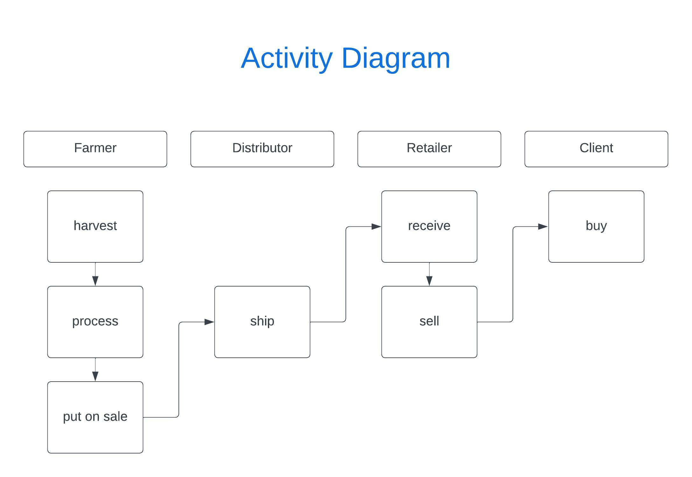
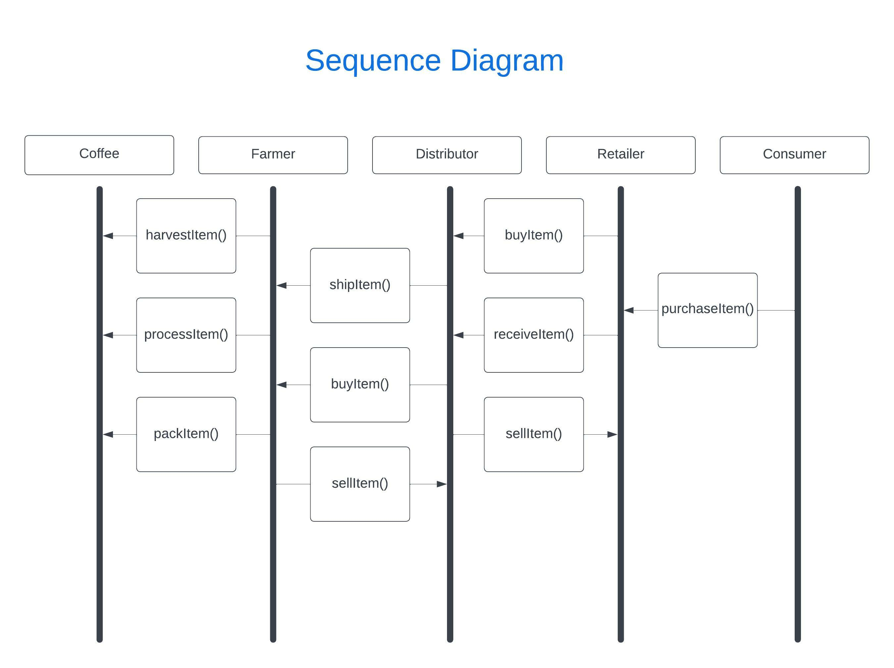
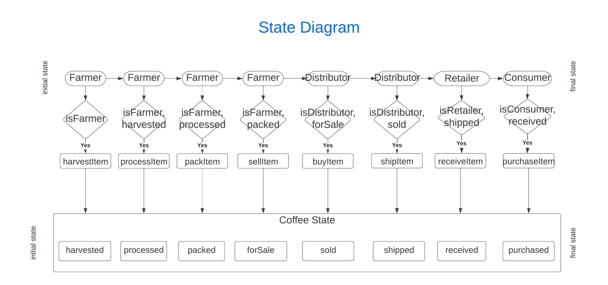
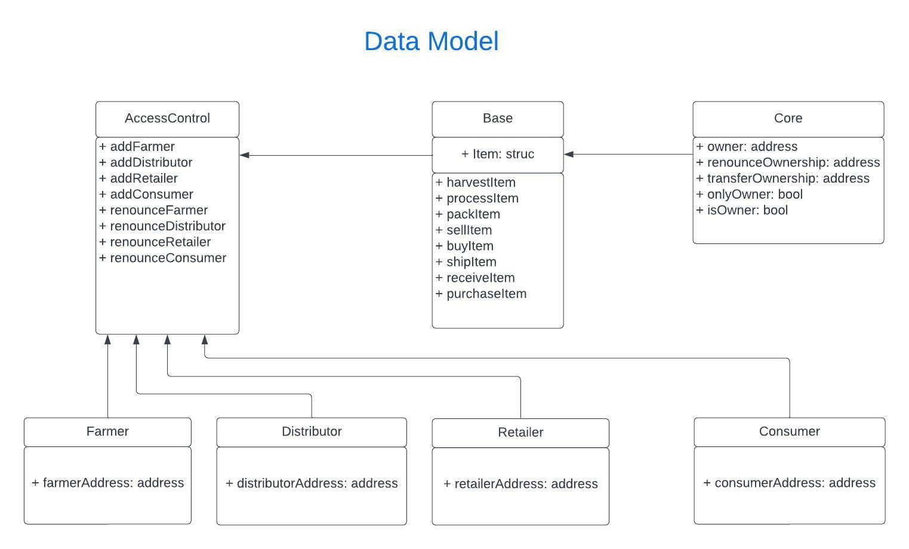

Compiling your contracts...
===========================
> Everything is up to date, there is nothing to compile.

Starting migrations...
======================
> Network name:    'rinkeby'
> Network id:      4
> Block gas limit: 30000000 (0x1c9c380)

1_initial_migration.js
======================

   Deploying 'Migrations'
   ----------------------
   > transaction hash:    0xe3146de83f062ed1c68d519a111eb3fcc3e4d70ca21c6e974a3911ba8699f437
   > Blocks: 1            Seconds: 4
   > contract address:    0xA559325b1FbC7F185525B81850c3A44076318585
   > block number:        10785632
   > block timestamp:     1654223732
   > account:             0x77749868Cfeee8329742e8DeaFB9406c8179A04A
   > balance:             0.4
   > gas used:            199177 (0x30a09)
   > gas price:           20 gwei
   > value sent:          0 ETH
   > total cost:          0.00398354 ETH

   Pausing for 2 confirmations...
   ------------------------------
   > confirmation number: 1 (block: 10785633)
   > confirmation number: 2 (block: 10785634)

   > Saving migration to chain.
   > Saving artifacts
   -------------------------------------
   > Total cost:          0.00398354 ETH

2_deploy_contracts.js
=====================

   Deploying 'FarmerRole'
   ----------------------
   <pre>
   > transaction hash:    0x5a6b8632a45b51322cbc2944b206129c3728c7a133273cd54a67dcf3f41d319b
   > Blocks: 0            Seconds: 12
   > contract address:    0x172C69D37Edf17De31BEB8C95427b61c9753cF4F
   > block number:        10785636
   > block timestamp:     1654223792
   > account:             0x77749868Cfeee8329742e8DeaFB9406c8179A04A
   > balance:             0.38884546
   > gas used:            312807 (0x4c5e7)
   > gas price:           20 gwei
   > value sent:          0 ETH
   > total cost:          0.00625614 ETH
   </pre>
   Pausing for 2 confirmations...
   ------------------------------
   > confirmation number: 1 (block: 10785637)
   > confirmation number: 2 (block: 10785638)

   Deploying 'DistributorRole'
   ---------------------------
   > transaction hash:    0x916be992917b9b9a202115449a5d9c00860b1d0995eb378ee55cca5ea4e30a77
   > Blocks: 0            Seconds: 12
   > contract address:    0x3689eDdd640309089826e2cb74a2Ed2548DB7F79
   > block number:        10785639
   > block timestamp:     1654223837
   > account:             0x77749868Cfeee8329742e8DeaFB9406c8179A04A
   > balance:             0.38258932
   > gas used:            312807 (0x4c5e7)
   > gas price:           20 gwei
   > value sent:          0 ETH
   > total cost:          0.00625614 ETH

   Pausing for 2 confirmations...
   ------------------------------
   > confirmation number: 1 (block: 10785640)
   > confirmation number: 2 (block: 10785641)

   Deploying 'RetailerRole'
   ------------------------
   > transaction hash:    0xb61398704b9d08083fbbfe6e5e7bffffe847ce8b9cc349ef99ddf689063037e7
   > Blocks: 0            Seconds: 12
   > contract address:    0x652726F8669313c95aFa3489943D09237d5232f9
   > block number:        10785642
   > block timestamp:     1654223882
   > account:             0x77749868Cfeee8329742e8DeaFB9406c8179A04A
   > balance:             0.3763327
   > gas used:            312831 (0x4c5ff)
   > gas price:           20 gwei
   > value sent:          0 ETH
   > total cost:          0.00625662 ETH

   Pausing for 2 confirmations...
   ------------------------------
   > confirmation number: 1 (block: 10785643)
   > confirmation number: 2 (block: 10785644)

   Deploying 'ConsumerRole'
   ------------------------
   > transaction hash:    0xd5c16e04aa3b8f891b57bc4eaf51c86b7e090ce82c6da69385d861f300a42e60
   > Blocks: 0            Seconds: 12
   > contract address:    0xf223868ed41cf72AE6fD1d1B09A721844Abb73Bf
   > block number:        10785645
   > block timestamp:     1654223927
   > account:             0x77749868Cfeee8329742e8DeaFB9406c8179A04A
   > balance:             0.37007656
   > gas used:            312807 (0x4c5e7)
   > gas price:           20 gwei
   > value sent:          0 ETH
   > total cost:          0.00625614 ETH

   Pausing for 2 confirmations...
   ------------------------------
   > confirmation number: 1 (block: 10785646)
   > confirmation number: 2 (block: 10785647)

   Deploying 'SupplyChain'
   -----------------------
   > transaction hash:    0x25880fe0e73d4b33fc88463f1885bc6a14110e3857cbf6697fc7513ba5bf05f5
   > Blocks: 1            Seconds: 12
   > contract address:    0x5322839eaF64E37E8cAf555B3B4BD4eb905F1Df6
   > block number:        10785648
   > block timestamp:     1654223972
   > account:             0x77749868Cfeee8329742e8DeaFB9406c8179A04A
   > balance:             0.31628542
   > gas used:            2689557 (0x290a15)
   > gas price:           20 gwei
   > value sent:          0 ETH
   > total cost:          0.05379114 ETH

   Pausing for 2 confirmations...
   ------------------------------
   > confirmation number: 1 (block: 10785649)
   > confirmation number: 2 (block: 10785650)

   > Saving migration to chain.
   > Saving artifacts
   -------------------------------------
   > Total cost:          0.07881618 ETH

Summary
=======
> Total deployments:   6
> Final cost:          0.08279972 ETH